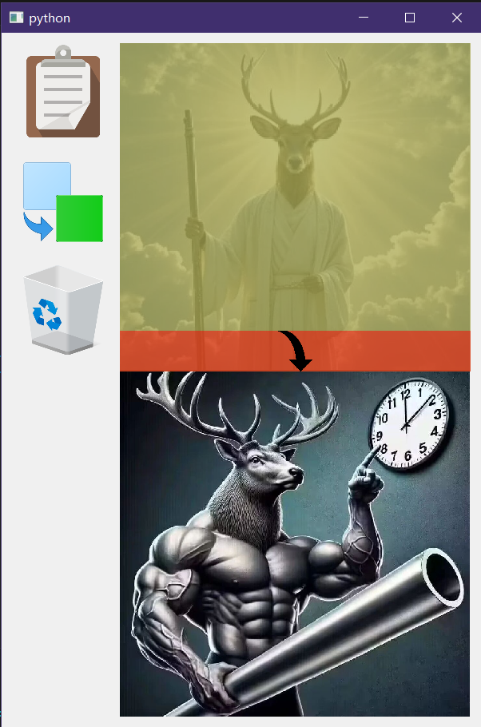

# XJQ_PictJointer

图片拼接器，可将图片横向/纵向的简单拼接。
懒得继续完善了，实际使用肯定诸多细节上的问题，算了，又不是不能用。

运行``Main.pyw``，项目依赖XJ_Python(v1.0.0)。

因为脚本有缓存行为(并且没做缓存清理工作)，不建议长时间运行。

***

支持以下功能：
- 外部文件拖拽放置(包括浏览器的网图)；
- 截图；
- 剪切板拖拽；
- 内部图片位置调整以及图片移除；
- 图片的横向/纵向拼接保存；

